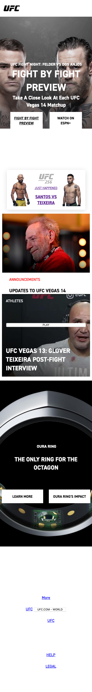
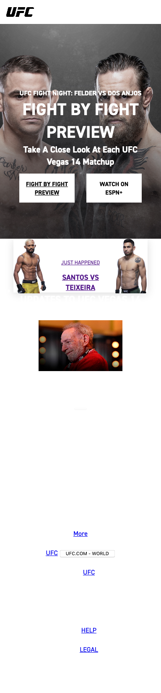
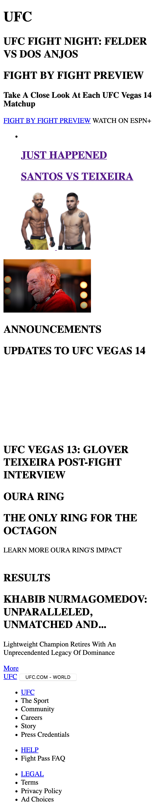
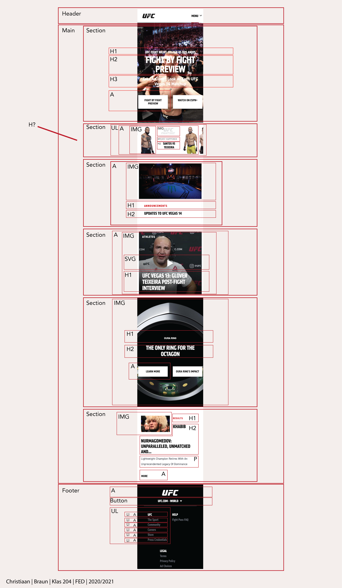
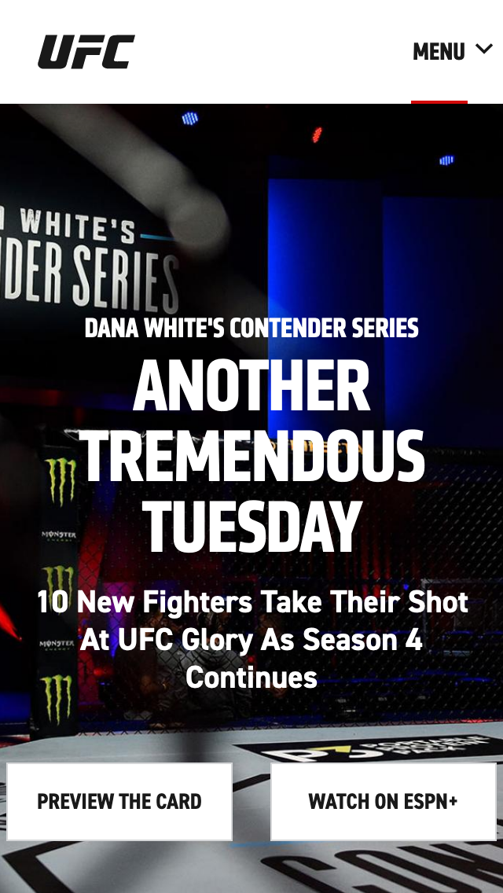
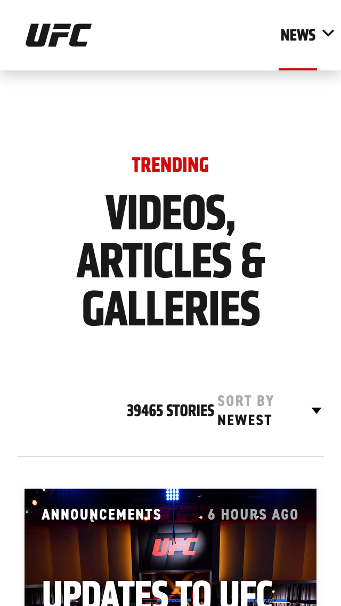

# Procesverslag
**Auteur:** Christiaan

Markdown cheat cheet: [Hulp bij het schrijven van Markdown](https://github.com/adam-p/markdown-here/wiki/Markdown-Cheatsheet). Nb. de standaardstructuur en de spartaanse opmaak zijn helemaal prima. Het gaat om de inhoud van je procesverslag. Besteedt de tijd voor pracht en praal aan je website.

## Bronnenlijst
1. http://www.ufc.com/
2. https://css-tricks.com/snippets/css/a-guide-to-flexbox/
3. https://www.youtube.com/watch?v=T8EYosX4NOo Video over intersection observer
4. https://www.youtube.com/watch?v=huVJW23JHKQ Tutorial over elementen in laten faden en scrollen

## Screenreader test

De pagina is redelijk te navigeren met een screenreader, alle links en teksten zijn bereikbaar.

Het menu vouwt open maar is met de screenreader altijd te bereiken, dit zou verholpen kunnen worden om de website te verbeteren.

De playknoppen op video's worden niet als playknop maar als normale knop opgelezen, een gebruiker die gebruik maakt van een screenreader zal waarschijnlijk niet snappen dat het om een playknop gaat.

## Eindgesprek (week 7/8)

De website was nog niet af tijdens dit gesprek :(

**Screenshot(s):**

-screenshot(s) van je eindresultaat-

## Voortgang 3 (week 6)

### Stand van zaken

Eerste pagina is bijna af qua HTML en CSS. Ik moet alleen nog aan de surface plane beginnen, alles is statisch. Zie hier stiekem een beetje tegenop omdat ik het nog nooit heb gedaan.

**Screenshot(s):**

### Agenda voor meeting

-samen met je groepje opstellen-

| Aron     | Christiaan               | Eva          | Menno            |
| ---      | ---                | ---          | ---              |
| Responsive text | Sticky image?, weet niet hoe heet heet, eerste header     | Niks             | Button animatie |
|          |   |              |                  |
|          |        |              |

### Verslag van meeting
We hebben geprobeerd mijn probleem op te lossen maar het is nog niet gelukt. Verder zijn is de ::after besproken en heeft Sanne uitgelegd hoe je text responsive kan maken.

## Voortgang 2 (week 5)

### Stand van zaken

Ben begonnen met CSS schrijven, tot nu toe gaat het prima. Vraag mij alleen af of ik niet te veel herhaal of onduidelijke code schrijf.

**Screenshot(s):**

### Agenda voor meeting

-samen met je groepje opstellen-

| Aron     | Christiaan               | Eva          | Menno            |
| ---      | ---                | ---          | ---              |
| Kortste manier om de pagina responsive te maken| CSS nakijken       | ?         | Centreren             |
|          | CSS positioneren.  |              |                  |
|          | Typografie         |              |

### Verslag van meeting
Meeting was kort maar krachtig, kort de dingen besproken die in ons tabel staan. Daarnaast hebben we feedback ontvangen over github dit kan namelijk beter bij worden gehouden.

## Voortgang 1 (week 3)

### Stand van zaken

HTML ging eigenlijk wel goed. Het kiezen van de juiste selectoren is nog even inkomen.

**Screenshot(s):**

### Agenda voor meeting

-samen met je groepje opstellen-

| Aron     | Christiaan               | Eva          | Menno            |
| ---            | ---                | ---          | ---              |
| Semtantiek HTML| Breakdownschets    | Idem         | Idem             |
| Kort houden CSS| CSS positioneren.  |              |                  |
|                | CSS selectors      |              |

### Verslag van meeting

Meeting ging prima, vooral gekeken naar HTML structuur en goed gebruik maken van CSS selectors. Volgende keer kan ik gerichter vragen stellen omdat ik meer gedaan heb :).

## Breakdownschets (week 1)

## Intake (week 1)

**Je startniveau:** rood

**Je focus:** surface plane

**Je opdracht:** https://www.ufc.com/

**Screenshot(s) van de eerste pagina (small screen):**

**Screenshot(s) van de tweede pagina (small screen):**

